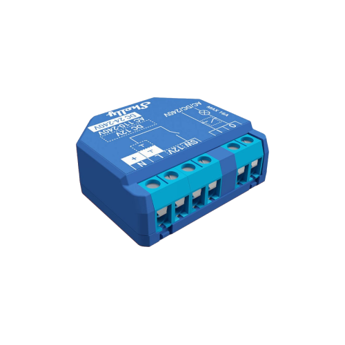
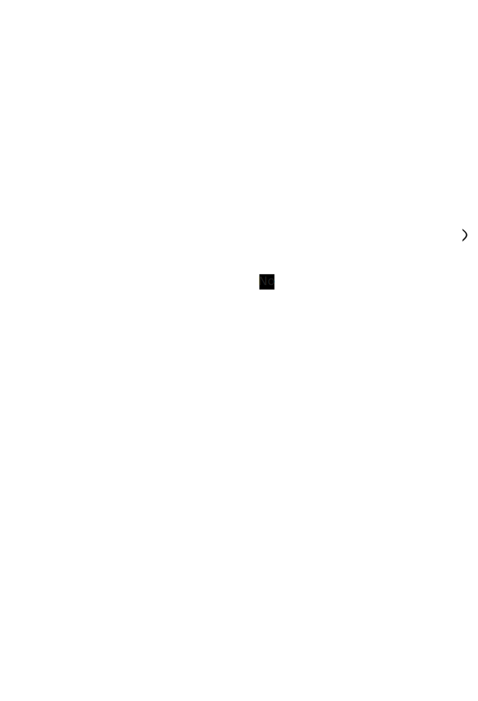

# Automatic Porch Light

## Introduction

My wife likes the porch light we have but it's just a dumb light - no sensor to turn it on when you walk up to it.  Here's what I've done to make this dumb light smart

## Sensors & Switches

There are 3 sensors/switches relevant to this automation:

1. Ring Doorbell v2 (without any subscription)


2. Sonoff SNZB-04 contact sensor 


3. Shelly Plus 1 relay



Why these? Well to be quite frank, because that's what I've got!  Pretty much any contact sensor and any relay would do.  For the doorbell, you need something that integrates with Home Assistant enough to provide an event when motion is detected.

## The Requirements

1. I must be able to turn the porch light on or off using the existing switch (only ever add functionality - don't take it away)
2. When someone approaches the front door and it's dark, turn the porch light on.  Turn if off again after some predetermined length of time
3. When the front door is opened, and it's dark, turn on the porch light.  Turn it off again after some predetermined length of time
4. Don't do (2) or (3) if the light has already been manually turned on

## The Setup

### Ring Doorbell

My Ring doorbell is fixed to the wall next to my front door with a relatively clear view of anyone approaching.  I've integrated it into Home Assistant using the standard Ring integration.  This exposes a number of sensors to Home Assistant.  When the Ring doorbell detects motion, the `_last_activity sensor` changes to the current date/time, so triggering an automation whenever the state of this sensor changes works for me:

``` yaml
triggers:
  - trigger: state
    entity_id:
      - sensor.front_door_last_activity
```

### Sonoff Contact Sensor

The SNZB-04 contact sensor is mounted on my front door so it triggers whenever the door is opened or closed.  However like all contact sensors I've tried, mounting position is critical so whilst I trust it's accuracy when the state changes (e.g. from Closed to Open or Open to Closed), I don't trust it's current state to be 100% accurate (i.e. it might still show as open when the door is closed due to a misalignment of the magnet and sensor)

### Shelly Relay

The Shelly Plus 1 relay is wired behind the porch light switch so when the switch is turned on, the Shelly relay is turned on and the light has power.  When the switch is turned off, the Shelly relay is turned off an the light doesn't have power. 

Note that I've configured the relay based on switch position, not on switch change, so switch-up is always off, switch-down is always on.  This does mean that if I toggle the relay remotely, the switch will be in the wrong position, but I'd rather this than not know which way to turn the switch to turn on the light (never remove functionality)

## Automation Flow

The complete automation flow is shown below



## Automation

Finally, here's the complete automation code:

```yaml
alias: Porch Light
description: ""
triggers:
  - trigger: state
    entity_id:
      - sensor.front_door_last_activity
    id: Porch Motion
  - type: opened
    device_id: e044698243105ee5a6d2351609365881
    entity_id: 127f6633fa0fb5e7a6c2970a9d0502b9
    domain: binary_sensor
    trigger: device
    id: Front Door Opened
  - trigger: sun
    event: sunrise
    offset: 0
    id: Sunrise
conditions: []
actions:
  - choose:
      - conditions:
          - condition: trigger
            id:
              - Porch Motion
              - Front Door Opened
          - condition: sun
            before: sunrise
            after: sunset
          - condition: device
            type: is_off
            device_id: 345891a48b82a6edfd2dd4231d461165
            entity_id: 66b4f7c9b969a78c78093517ccb9ccb7
            domain: switch
        sequence:
          - action: switch.turn_on
            metadata: {}
            data: {}
            target:
              entity_id: switch.shellyplus1_78ee4cd63de4
          - delay:
              hours: 0
              minutes: 5
              seconds: 0
              milliseconds: 0
          - action: switch.turn_off
            metadata: {}
            data: {}
            target:
              entity_id: switch.shellyplus1_78ee4cd63de4
        alias: Porch Motion Detected or Front Door Open AND dark and light off
      - conditions:
          - condition: trigger
            id:
              - Sunrise
          - condition: device
            type: is_on
            device_id: 345891a48b82a6edfd2dd4231d461165
            entity_id: 66b4f7c9b969a78c78093517ccb9ccb7
            domain: switch
        sequence:
          - action: switch.turn_off
            metadata: {}
            data: {}
            target:
              entity_id: switch.shellyplus1_78ee4cd63de4
        alias: Porch Light is on AND its before dawn
mode: restart
```