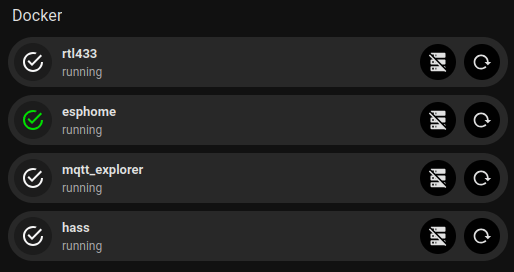
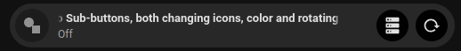
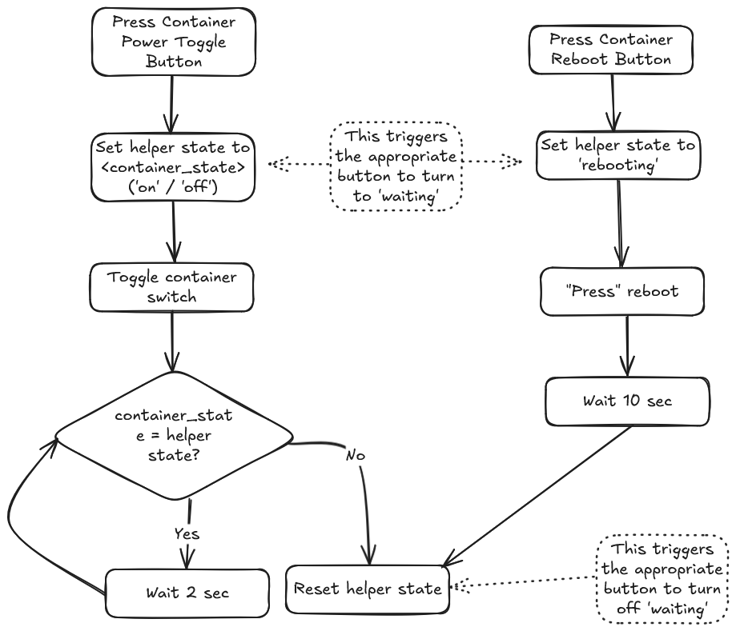
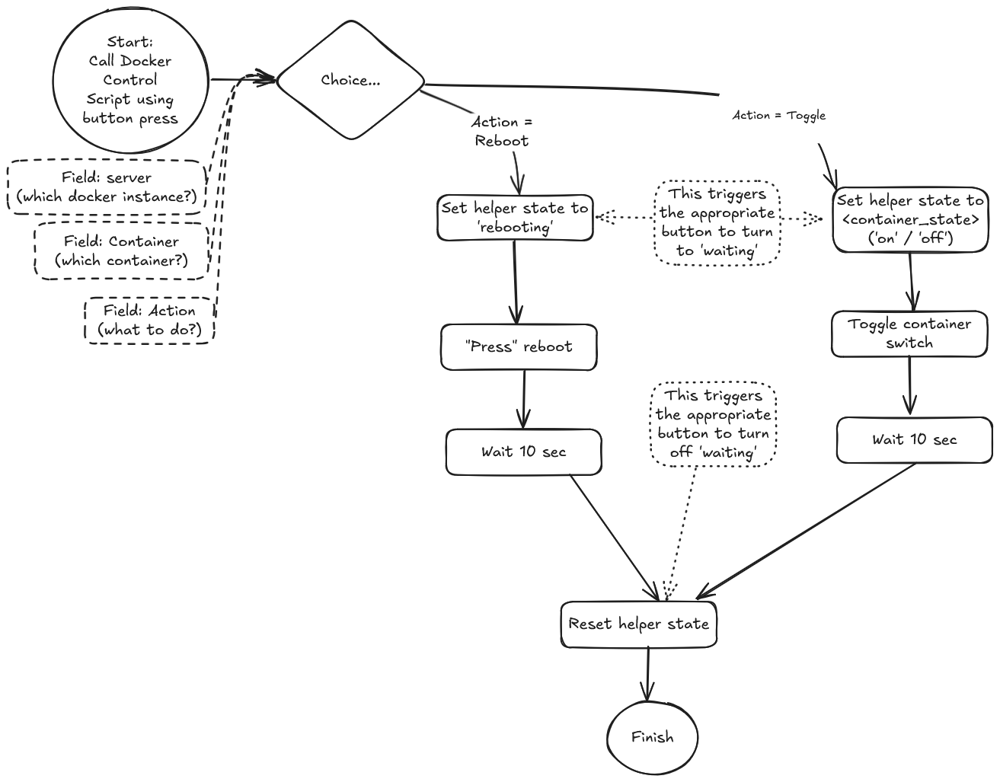

# Docker Container Control in Home Assistant

> [!Warning]
>
> This is a work in progress - do not use!



> [!NOTE]
> This is a modified version of my [Proxmox Container and Virtual Machine Control](./proxmox_control.md) write-up 

## Aims

- I want to start, shutdown and or reboot various Docker containers from within Home Assistant
- Using [Bubble Card](https://github.com/Clooos/Bubble-Card) for the interface would be good as it will fit with some of my other dashboards
- Reuse my existing [Proxmox Control](./proxmox_control.md) elements where possible!

## TL:DR

This article presents: 

1. Docker-compose and Home Assistant configurations necessary to bring docker containers into Home Assistant as entities
2. A Home Assistant [script](./scripts/docker_container_control.yaml) that can be used to control (start, shutdown, or reboot) multiple Docker containers
3. A Home Assistant [interface element](./interface_elements/docker_control_interface.yaml) and an [example button template](./interface_elements/docker_control_bubble_card_button_example.yaml) that works with the script to control Docker containers

The interface buttons use Bubble Card to provide a single button for each Docker container including:

- Status of the container (on/off/pending/rebooting)
- (if available) Container health
- A sub-button to toggle between on/off
- A sub-button to reboot
- Sub-button icons change color and change to a spinning 'working' icon during transitions

## Steps

1. Setup [Docker access](#Docker-access) within HA
2. Create the [Bubble Card Buttons](#bubble-card-styling)
3. [Control feedback](#problem---button-presses-are-instantaneous) for button presses
4. Generate [single script to handle multiple conditions](#generate-single-script-to-handle-multiple-conditions) (start/shutdown/reboot)

## Docker Access

Home Assistant doesn't have a built in Docker integration, but there's a HACS customer integration that will do the job nicely.  The HACS integration is called [Custom Monitor Docker component for Home Assistant](https://github.com/ualex73/monitor_docker).  The Monitor Docker component allows you to monitor Docker and container statistics and turn on/off containers.  It can connect to the Docker daemon locally or remotely.  

Full configuration instructions are contained within the repository.  For my specific installation I've chosen to use [Tecnativa's Docker Socket Proxy](https://github.com/Tecnativa/docker-socket-proxy) rather than connecting directly to the docker socket.  I've chosen to do this mainly because I have multple machines running docker and HA isn't necessarily running on the same machine.

### Docker Access Setup 1 - Docker Socket Proxy

Full instructions are [on the Github here](https://github.com/Tecnativa/docker-socket-proxy).  I'm just presenting how I've done it for 1 machine. 

> [!WARNING]
>
> Never expose this container's port to a public network.  Only to an internal network necessary for the communication between the proxy and the service that is using it (Home Assistant in this case)
>
> Enabling `POST` access to the docker socket has some pretty huge security implications.  Do so at your own risk!

My docker compose is [here](./docker/docker-socket-proxy_compose_example.yml).  I've based this off a question in the [Monitor Docker Q&A](https://github.com/ualex73/monitor_docker#qa)

### Docker Access Setup 2 - Home Assistant Custom Monitor Component

I'm not going to go through adding HACS to Home Assistant - there are a million turorials already written.

**Monitor Docker** is in the main HACs repository, just seach for it and add it the same as you would any other integration.

Configuration of Monitor Docker is done in `configuration.yaml`, there isn't a UI for doing this.  My [sample configuration is here](./config_snippets/monitor_docker.yaml) but as usual, there's far more detail in the [ualex73's github](https://github.com/ualex73/monitor_docker)

For the purposes of my switches, I've only enabled controls for container `state`, `status` and `health` but there's many more that could be added to do other things

This then exposes the following entities:

- `button.<docker-host>_<container>_restart` 
- `sensor.<docker-host>_<container>`
- `sensor.<docker-host>_<container>_health`
- `sensor.<docker-host>_<container>_state`
- `sensor.<docker-host>_<container>_status`
- `switch.<docker-host>_<container>`

[🔼 Back to top](#docker-container-control-in-home-assistant)

## Bubble Card Styling

I spent a lot of time getting the controls to behave the way I wanted.  Key requirements were:

- 2 sub buttons
    - start / shutdown
    - reboot
- Container status displayed (e.g. Running / Not Running)
- Visual feedback when the state is changing
    - Change of color / icon as appropriate
    - Spinning wait icons (because it's about time I figured out how to do this!)

The end result (in a generic button) looks like this:



All the details for creating this are [here](./bubblecard/bubblecard_styling_snippets.md)


[🔼 Back to top](#docker-container-control-in-home-assistant)

## Controlling User Feedback

### Problem - Button presses are instantaneous

The Docker HA integration exposes buttons to reboot a container and a switch to toggle between On and Off.  However a button press is an instantaneous thing - you press it, a command is sent to the docker socket, but you don't get any feedback until seconds later when the status of the target eventually changes and feeds back to HA.  Additionally, the on/off toggle is instantaneous but it takes a finite amount of time for the docker container to react and start or shutdown.

The docker integration polls every 10 seconds (this is configurable), but that's not 10 seconds from when you trigger an action, so you the poll might occur 1 second, 10 seconds (or anything in between) after you trigger the action.  This can leave you guessing whether the command has actually registerd properly or may give deceptive feedback if the poll happens before the container has reacted - neither are desirable outcomes.

<details>
  <summary>Solution</summary>

### Solution

I had to think about this for a while.  Initially I thought I'd just wait for 30 seconds after triggering an action, but for docker containers, that can be a very long time even if I provide feedback.  

For my [Proxmox Control example](./proxmox_control.md) I used a Bubble Card with 2 sub-buttons; when each sub-button is clicked, the icon changes color, changes to a loading symbol and rotates while the change of state happens (see example below).


I think I can use something similar for this example.

- For start and shutdown, I initially thought about comparing the state of the container before the action (on/off) to the current state, I should be able to detect if the action has completed successfully.  However the Bubble Card above relies on detecting a specific state of an entity in order to trigger the waiting indicator, so I'll use a helper to hold this state.  This approach proved rather difficult so in the interest of time, I resorted to the same approach that I've used for reboots - I might come back to this at a later time

- For reboots, the problem is slightly different - the beginning and end state of the container state will be the same (before and after state are both `on`) however I could use the same helper to hold a value that will trigger the button waiting state for 10 seconds before returning to the reboot icon - that will be long enough to cover the polling delay

I've illustrated this flow below (including my initial thoughts on comparing values for the toggle state)



</details>

[🔼 Back to top](#docker-container-control-in-home-assistant)

## Generate single script to handle multiple conditions

### Problem - Passing Fields to scripts

I need a script that runs when a button is pressed.  Looking at the flow above, for the container in question it would then start, shutdown, or reboot depending on which button is pressed and the current state of the continer.  
However, I don't want to create a new script for each scenario, or for each container.

<details>
  <summary>Solution</summary>

### Solution

[u/domwrap](https://www.reddit.com/user/domwrap/) kindly suggested the use of fields within the script. The full details are in the [Home Assistant documentation](https://www.home-assistant.io/integrations/script), but in summary, as part of the action, variables can be passed to a script so they become available within templates in that script.  To configure a script to accept variables using the UI, the variables can be added as fields in the script editor.

</details>

### Problem - Choosing which container to act on

I'm currently running > 40 docker containers across lots of different machines, but for the sake of this example, I'm going to concentrate on 2 containers - `rtl433` and `esphome`, both running on a server called `maggie`. I'd like to control all of them with this script.  How to get the single script acting correctly on each container.

<details>
  <summary>Solution</summary>

### Solution

All of the container's entities have a similar naming convention:  `<domain>.<server>_<container>`, so for example:

- `sensor.maggie_rtl433_health` is the health of my rtl433 container **(if it includes healthchecks)**
- `button.maggie_rtl433_restart` is the reboot button for the container
- `sensor.maggie_rtl433_state` is the state of the container e.g. `running` / `exited`
- `switch.maggie_rtl433` is an on/off switch for the container

so if the script has fields for:

- `server` (the docker instance that the container is running on)
- `container` (the name of the docker container)
- `action` (start, shutdown, or reboot)...

I can use the following templates:

- To determine which action has been selected (`toggle` or `reboot`)
  - `value_template: "{{ action | lower == 'toggle' }}"` is true if action = `toggle` - substitute `reboot` if required
- To determine whether the container is current running
  - `entity_id: "{{ 'switch.' + server + '_' + container }}"` is the target entity (the on/off switch for the container that will tell us if it's currently running).  We can also use this later to toggle the container on or off.
  - `value_template: "{{ states('switch.' + server + '_' + container) == 'on' }}"` is true if the continer status is `on` - substitute `off` if required
- To address the reboot button
- `entity_id: "{{ 'button.' + server + '_' + container + '_restart' }}"`

Thanks to [u/generalambivalence](https://www.reddit.com/user/generalambivalence/) and [u/matzman666](https://www.reddit.com/user/matzman666/) for helping me with the templates

</details>

### Problem - Coping with multiple button presses

In the Proxmox version of this script, I wanted to be able to trigger actions on several containers at once since the poll rate for the Proxmox integration was slow (~30sec) and VMs/LXCs could take some time to start up or shut down.  Docker tends to work faster than this, so to avoid complications (particularly with the helper entity that is external to the control script), I don't want more than one instance of the script running at a time.

<details>
  <summary>Solution</summary>

### Solution

After going back to the Home Assistant docs, I was reminded about [Script Modes](https://www.home-assistant.io/integrations/script#script-modes).
The full details are in the documentation but in sumamary, scripts be run in 1 of 4 different modes:

- `single`: Do not start a new run.  Issue a warning
- `restart`: Start a new run after first stopping previous run
- `queued`: Start a new run after all previous runs complete.  Runs are guaranteed to execute in the order they were queued
- `parallel`: Start a new, independent run in parrallel with previous runs

For my use-case, `queued` fits the best as I want to each button press run sequentiallyto be treated independently

In yaml, it then looks like this:

```yaml
mode: queued
max: 10
```

Note, the `max: 10` can be used to limit the number instances of the script that can be queued

Alternatively, if you're making scripts in the user interface, the script mode can be set using the top-right menu:


</details>

## Result

### Script Flow

The script flow is shown below:



The full script is here:

[Script: Docker Container Control](./scripts/docker_container_control.yaml)

This works with this set of buttons:


The yaml for these buttons is [here](./interface_elements/docker_control_interface.yaml)

and the yaml for a sample button with how to adapt it for your own containers is [here](./interface_elements/docker_control_bubble_card_button_example.yaml)

[🔼 Back to top](#docker-container-control-in-home-assistant)

## Credits

Thanks to 

- [u/Clooooos](https://www.reddit.com/user/Clooooos/) because [Bubble Cards](https://github.com/Clooos/bubble-card) are just awesome!
- [u/aponomar](https://www.reddit.com/user/aponomar/) who suggested using a python set_state script
- [Xannor](https://github.com/xannor) who wrote the python set_state script for Home Assistant
- [u/domwrap](https://www.reddit.com/user/domwrap/) who pointed me towards fields for scripts
- [u/generalambivalence](https://www.reddit.com/user/generalambivalence/) and [u/matzman666](https://www.reddit.com/user/matzman666/) for helping me with the templates

[🔼 Back to top](#docker-container-control-in-home-assistant)


