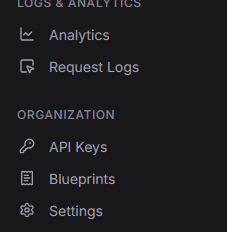
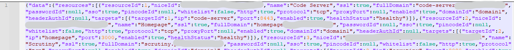

# Pangolin Public Resource Control from Home Assistant

## Aims

- I want to enable or disable various Pangolin public resources from within Home Assistant

## Disclaimer

I used ChatGPT to help develop this method.  It works for me using Pangolin 1.14.1 Community Edition and Home Assistant 2026.1.2

I'm not a coding expert and I'm not a security expert.  Use it at your own risk, but if you see any mistakes or have any concerns about how I'm doing this, please raise an issue so I and others can benefit from your knowledge.

## TL:DR

This article presents a method to enable and disable a public Pangolin resource from within Home Assistant using RESTful commands and the Pangolin Integration API.

The basics are covered but this is a work in progress.  Other things I'd like to add:
- Build a proper HA switch entity to control this
- Auto-discover the `resourceId` from `niceId` (`niceId` is available in the Pangolin interface, `resourceId` isn't)
- Make a generic Pangolin enable/disable service
- Get a "live" update of enabled state for a resource so HA knows the current state of the resource

## Prerequisites

- A working [Pangolin](https://docs.pangolin.net/) installation.  I've tested this using Pangolin v1.14.1 Community Edition.
- At least one public resource being proxied through Pangolin
- A linux terminal with `curl` installed
- A working Home Assistant installation

> Note
>
> Pangolin is in heavy development. The REST API routes and behavior may include braking changes between updates. 

## Steps

1. Enable the Pangolin Integration API.  I'm not going to cover this in detail - there is an excellent writeup in the [Pangolin Docs](https://docs.pangolin.net/self-host/advanced/integration-api).  To confirm the Integration API is working for your instance, got to https://api.my.domain/v1/docs.  If the Swagger docs for the API load, your API is enabled and working
2. In your Pangolin instance, create an [Organization API Key](#organization_api_key)
3. [Test the required commands](#test_the_required_api_calls) and gather required information
4. [Setup RESTful commands](#setup_restful_commands) in Home Assistant
5. [Call the commands](#call_the_commands) from within Home Assistant

## Organization API Key

In your Pangolin instance, open the organization API Keys section



On the **Manage API Keys** page, click on the `+ Generate API Key` button to create a new API Key and give your new key a name.  Under the permissions you should select the minimum amount of permissions necessary - in my case, the only thing I want to use this key for is to enable / disable resources, so I'm using the following permissions (and **only** these permissions)
- `Get Resource`
- `List Resources`
- `Update Resource`

At the bottom of the page, click the `Generate` button then make a note of the generated key 

> Notes
>
> This is the only time you will be able to see the whole key - if you don't record it now, you'll have to create a new key
>
> You can edit the API key permission later if you want to add more capabilities

Once you've made a note of the API key, you can click `Done` to finish

## Test the Required API Calls

There are 3 main API calls that you're going to need.  It's worth testing these in a command prompt before building it into Home Assistant.  We can also use this to gather some necessary information

### Gather information for all resources

The API call to gather information on all resources is `GET /org/{orgId}/resources`.  In order to use this, you'll need your `orgId`.  

- In your Pangolin instance, open the Organization Settings section (it's below the API Keys)
- On the Organization Settings page, the top box will show your Organizations name, the Organization ID and the Subnet - make a note of the Organization ID

Now that you've got the orgId, you can make this API call from a command prompt:

```bash
curl -s -H "Authorization: Bearer {my-api-key}" \
     "https://api.{my.domain}/v1/org/{orgId}/resources"
```
Obviously you'll need to substitute the following in this command:
- {my-api-key}
- {my.domain}
- {orgId}

If everything is working, this should return a block of json listing the properties of all of the resources within your organization.  



This can be a really long list, but the within it, you'll be able to find the name of your resource (e.g. Code Server), and before that the `resourceId` (in this case "1") - **you need to make a note of this resourceId for later commands**.

### Enable / Disable a Resource

Now that we've got the relevant `resourceId`, we can test the command to enable / disable the resource: `POST /resource/{resourceId}`

Try this command in a linux terminal:
```bash
curl -X POST "https://api.{my.domain}/v1/resource/{resourceId}" \
     -H "Authorization: Bearer {my-api-key}" \
     -H "Content-Type: application/json" \
     -d '{
           "enabled": false
         }'
```
You'll need to substitute the following in this command:
- {your.domain}
- {resourceId}
- {my-api-key}

When you run this command you should get a block of json returned showing all the properties for the one resource that you've targetted. At the end of the JSON block, you should see

```
},"success":true,"error":false,"message":"HTTP resource updated successfully","status":200}
```
What you're looking for is `"success":true`.  You can also go back to the Pangolin management console and click on `Resources | Public`.  You should see the resource you just targetted is now disabled.

To enable the resource, run the same command again, but change `"enabled": false` to `"enabled": true`.

## Setup RESTful Commands

Home Assistant's [RESTful Command](https://www.home-assistant.io/integrations/rest_command/) integration can expose regular REST commands as actions.  These actions can then be called from a script or in an automation.

To use this integation, you'll need to add the following lines to your Home Assistant's configuration files. If you already have a `rest_command:` section, merge the entries, don’t duplicate the key.

For this example, I'm going to build commands for my Bazarr server which has a `resourceId` of `7`

#### configuration.yaml
```yaml
rest_command:
# Enable Bazarr within Pangolin
  enable_bazarr:
    url: "https://api.{my.domain}/v1/resource/{resourceId}"
    method: POST
    headers:
      Authorization: !secret pangolin_authorization_header
      Content-Type: "application/json"
    payload: >
      {
        "enabled": true
      }

# Disable Bazarr within Pangolin
  disable_bazarr:
    url: "https://api.{my.domain}/v1/resource/{resourceId}"
    method: POST
    headers:
      Authorization: !secret pangolin_authorization_header
      Content-Type: "application/json"
    payload: >
      {
        "enabled": false
      }
```
You'll need to substitute the following in this command:
- {my.domain}
- {resourceId} - (7 in my case)
- {my-api-key}

#### secrets.yaml

```yaml
pangolin_authorization_header: "Bearer {my-api-key}"
```

You'll need to substitute {my-api-key} with your actual API key.  If you don't have a secrets.yaml yet, take a look at this article on [storing secrets in Home Assistant](https://www.home-assistant.io/docs/configuration/secrets/)

## Call the Commands

How to call it from Home Assistant

From **Developer Tools → Actions** or an automation:

```yaml
service: rest_command.disable_bazarr
```

```yaml
service: rest_command.enable_bazarr
```