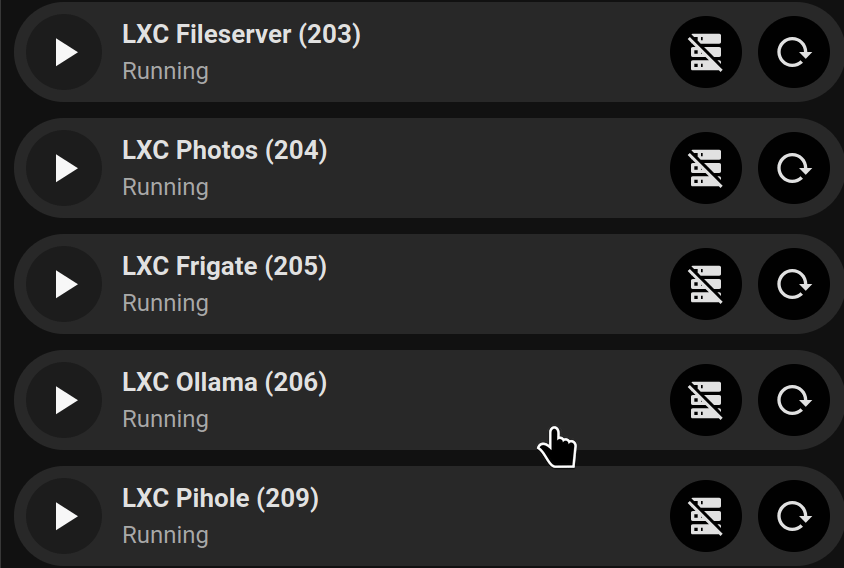
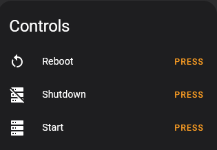
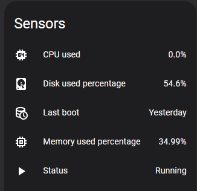
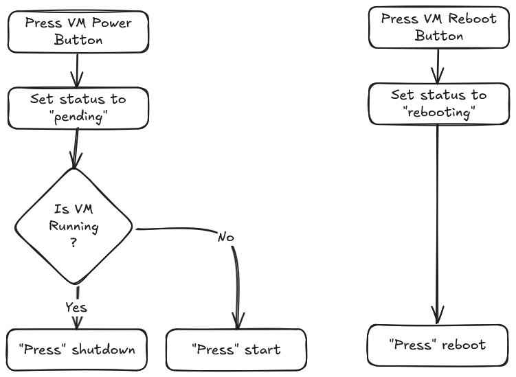
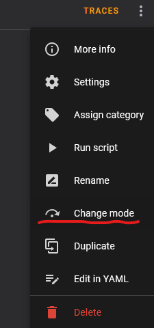
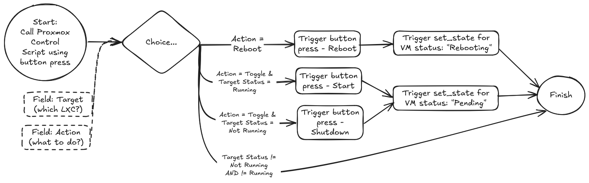

# Proxmox Container and Virtual Machine Control



## Aims

- I want to start, shutdown and or reboot various Proxmox LXCs and VMs from within Home Assistant
- Using [Bubble Card](https://github.com/Clooos/Bubble-Card) for the interface would be good as it will fit with some of my other dashboards

## TL:DR

This article presents 

1. A Home Assistant [script](./scripts/proxmox_lxc_control.yaml) that can be used to control (start, shutdown, or reboot) multiple Proxmox VE LXCs/VM
2. A Home Assistant [interface element](./interface_elements/proxmox_control_interface.yaml) that works with the script to control 4 different Proxmox VE LXCs

The interface buttons use Bubble Card to provide a single button for each LXC including:
- Status of the LXC (on/off/pending/rebooting)
- A sub-button to toggle between on/off
- A sub-button to reboot
- Sub-button icons change color and change to a spinning 'working' icon during transitions

## Steps

1. Setup [Proxmox access](#proxmox-access) within HA
2. Setup a [python set_state script](#python-set_state-script)
3. Create the [Bubble Card Buttons](#bubble-card-styling)
4. Generate [single script to handle multiple conditions](#generate-single-script-to-handle-multiple-conditions) (start/shutdown/reboot)

## Proxmox Access

Home Assistant has a built in Proxmox VE integration, but there's also a HACS custom intergration that provides some additional capabilities such as allowing you to poll various data and controls from your instance.

The HACS integration is [here](https://github.com/dougiteixeira/proxmoxve).  This should expose all of your VMs and LXCs as devices but by default, most entities and sensors are disabled.  You'll need to select which entities will be useful and you want to enable.  
I've enabled the following controls:



and the following sensors:



There are more that can be enabled, but I felt these gave me sufficient information for my needs.

[🔼 Back to top](#proxmox-container-and-virtual-machine-control)

## Python Set_State Script

### Problem - Button presses are instantaneous

The Proxmox HA integration exposes buttons to start, shutdown and reboot VMs and LXCs.  However a button press is an instantaneous thing - you press it, a command is sent to Proxmox, but you don't get any feedback until seconds later when the status of the target eventually changes and feeds back to HA.  This leaves you guessing whether the command has actually registered properly.


<details>
  <summary>Solution</summary>

### Solution

I'm sure there better ways of doing this, but I've chosen to implement a python set_state script.  This lets me change the state of an entity in HA to pretty much anything I want. Note changing this state doesn't actually trigger anything on it's own, and the next time the entity is updated, my set_state command will be overwritten.  For example:

The entity `binary_sensor.lxc_ollama_206_status` is a binary sensor - it's values can only be `on` and `off` (the HA interface represents these as `Running` and `Not Running` but behind the scenes it's still `on` and `off`).  However by using the python set_state script, I can set the status to (for example) `pending` or `rebooting`.  

Using this, I could build a flow as follows:



### The Implementation

All the details have been worked out by [Xannor](https://github.com/xannor/hass_py_set_state/tree/master) as a custom repo that can be added to HACS, however as it's just a python script, it can also be loaded manually.  
At the time of writing, Xannor's repo hasn't been updated for 6 years, so I've forked the repo [here](https://github.com/shaftspanner/hass_py_set_state).  Note that I loaded the script manually as I didn't want to go through the hassle of reinstalling HACs.

The script can be called using the following:

```yaml
action: python_script.set_state
data:
  entity_id: binary_sensor.lxc_ollama_206_status
  state: rebooting
```


</details>


[🔼 Back to top](#proxmox-container-and-virtual-machine-control)

## Bubble Card Styling

I spent a lot of time getting the controls to behave the way I wanted.  Key requirements were:

- 2 sub buttons
    - start / shutdown
    - reboot
- VM/LXC status displayed (e.g. Running / Not Running)
- Visual feedback when the state is changing
    - Change of color / icon as appropriate
    - Spinning wait icons (because it's about time I figured out how to do this!)

The end result (in a generic button) looks like this:


All the details for creating this are [here](./bubblecard/bubblecard_styling_snippets.md)


[🔼 Back to top](#proxmox-container-and-virtual-machine-control)

## Generate single script to handle multiple conditions

### Problem - Passing Fields to scripts

I need a script that runs when a button is pressed.  Looking at the flow above, for the VM/LXC in question it would then start, shutdown, or reboot the VM/LXC depending on which button is pressed and the current state of the VM/LXC.  
However, I don't want to create a new script for each scenario, and for each VM/LXC.

<details>
  <summary>Solution</summary>

### Solution

[u/domwrap](https://www.reddit.com/user/domwrap/) kindly suggested the use of fields within the script. The full details are in the [Home Assistant documentation](https://www.home-assistant.io/integrations/script), but in summary, as part of the action, variables can be passed along to a script so they become available within templates in that script.  To configure a script to accept variables using the UI, the variables can be added as fields in the script editor.

</details>

### Problem - Choosing which VM/LXC to act on

At the time of writing, I've got 8 LXCs running and I'd like to control all of them with this script.  How to get the single script acting correctly on each LXC.

<details>
  <summary>Solution</summary>

### Solution

All of the LXCs entities have a similar naming convention:  `<<domain>>.<<lxc_name>>_<<entity>>`, so for example:

- `binary_sensor.lxc_ollama_206_status` is the status of my Ollama LXC
- `button.lxc_ollama_206_reboot` is the reboot button for the LXC
- `button.lxc_ollama_206_shutdown` is the shutdown button for the LXC
- `button.lxc_ollama_206_start` is the start button for the LXC

so if the script has fields for `target` (the LXC name) and `action` (start, shutdown, or reboot) I can use the following templates:

- `value_template: "{{ action | lower == \"toggle\" }}"` is true if action = `toggle` - substitute `reboot` if required
- `entity_id: "{{ 'binary_sensor.' + target + '_status' }}"` is the target entity status
- `value_template: "{{ states('binary_sensor.' + target + '_status') == 'on' }}"` is true if the target status is `on` - substitute `off` if required
- `entity_id: "{{ 'button.' + target + '_' + action }}"` is the target entity's button (for start, shutdown, or stop)

Thanks to [u/generalambivalence](https://www.reddit.com/user/generalambivalence/) and [u/matzman666](https://www.reddit.com/user/matzman666/) for helping me with the templates

</details>

### Problem - Coping with multiple button presses - Part 1

I've got several Proxmox VM and I don't want to wait for an action to complete on one before I start an action on another (e.g. I want to shutdown 2 VMs)

<details>
  <summary>Solution</summary>

### Solution

After going back to the Home Assistant docs, I was reminded about [Script Modes](https://www.home-assistant.io/integrations/script#script-modes).
The full details are in the documentation but in sumamary, scripts be run in 1 of 4 different modes:

- `single`: Do not start a new run.  Issue a warning
- `restart`: Start a new run after first stopping previous run
- `queued`: Start a new run after all previous runs complete.  Runs are guaranteed to execute in the order they were queued
- `parallel`: Start a new, independent run in parrallel with previous runs

For my use-case, `parallel` fits the best as I want to each button press to be treated independently

In yaml, it then looks like this:

```yaml
mode: parallel
max: 10
```

Note, the `max: 10` can be used to limit the number instances of the script that can be running at the same time

Alternatively, if you're making scripts in the user interface, the script mode can be set using the top-right menu:



</details>

### Problem - Coping with multiple button presses - Part 2

Each VM has 2 buttons - one for start/shutdown and a 2nd button for reboot.  If I've pressed the button to reboot a machine, I don't want the start/shutdown to be triggered while the reboot is still in progress.

<details>
  <summary>Solution</summary>

### Solution

To solve this, I'll create an option within my script that will be triggered if the status of the VM being called is anything other than 'on' and 'off'.  The code snippet for this is shown below:

```yaml
- conditions:
  - condition: and
    conditions:
      - condition: template
        value_template: "{{ states('binary_sensor.' + target + '_status') != 'on' }}"
      - condition: template
        value_template: "{{ states('binary_sensor.' + target + '_status') != 'off' }}"
sequence: []
alias: If action is already in progress
```

</details>

## Result

### Script Flow

The script flow is shown below:



The full script is here:

[Script: Proxmox LXC Control](./scripts/proxmox_lxc_control.yaml)

This works with this set of buttons:

*** Insert button image here (204 - End) ***

The yaml for these buttons is here:


[🔼 Back to top](#proxmox-container-and-virtual-machine-control)

## Credits

Thanks to 

- [u/Clooooos](https://www.reddit.com/user/Clooooos/) because [Bubble Cards](https://github.com/Clooos/bubble-card) are just awesome!
- [u/aponomar](https://www.reddit.com/user/aponomar/) who suggested using a python set_state script
- [Xannor](https://github.com/xannor) who wrote the python set_state script for Home Assistant
- [u/domwrap](https://www.reddit.com/user/domwrap/) who pointed me towards fields for scripts
- [u/generalambivalence](https://www.reddit.com/user/generalambivalence/) and [u/matzman666](https://www.reddit.com/user/matzman666/) for helping me with the templates

[🔼 Back to top](#proxmox-container-and-virtual-machine-control)


