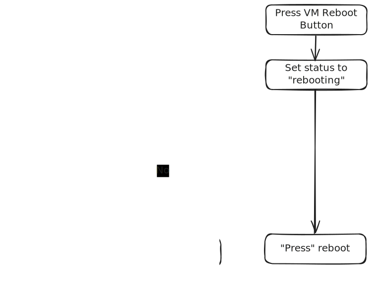

# Proxmox Container and Virtual Machine Control

## Aims

- I want to start, shutdown and or reboot various Proxmox LXCs and VMs from within Home Assistant
- Using [bubblecard](https://github.com/Clooos/Bubble-Card) for the interface would be good as it will fit with other dashboards

## Steps

1. Setup Proxmox access within HA
2. Setup a python set_state script
2. Generate single script to handle multiple conditions (start/shutdown/reboot)
3. Style the bubblecard buttons

## Python Set_State Script

### The Problem

The Proxmox HA integration exposes buttons to start, shutdown and reboot VMs and LXCs.  However a button press is an instantaneous thing - you press it, a command is sent to Proxmox, but you don't get any feedback until seconds later when the status of the target eventually changes and feeds back to HA.  This leaves you guessing whether the command has actually registered properly.

### The Solution

I'm sure there better ways of doing this, but I've chosen to implement a python set_state script.  This lets me change the state of an entity in HA to pretty much anything I want. Note changing this state doesn't actually trigger anything on it's own, and the next time the entity is updated, my set_state command will be overwritten.  For example:

The entity `binary_sensor.lxc_ollama_206_status` is a binary sensor - it's values can only be `on` and `off` (the HA interface represents these as `Running` and `Not Running` but behind the scenes it's still `on` and `off`).  However by using the python set_state script, I can set the status to (for example) `pending` or `rebooting`.  

Using this, I could build a flow as follows:

## Bubble Card Styling

Here's my list of [Bubblecard styling snippets](./bubblecard/bubblecard_styling_snippets.md).  The most relevant snippet for this example is [2 Rotating Sub-Buttons with color and icon change](./bubblecard/bubblecard_styling_snippets.md#2-rotating-sub-buttons-with-color-change)

## Credits

