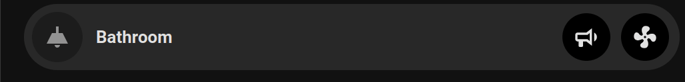

# Signal Lights

## TL:DR

Use lights as an alert.  The final script is [here](./scripts/call_with_lights.yaml)



## Background

My teenage son is notorious for taking long showers - I supose I shouldn't complain - at least he's washing!  However, his long showers are costing me a fortune in heating and water bills and I'm getting tired of banging on the bathroom door.

I've decided I need some way to signal to him that it's time to get out of the shower without banging on the door, and Home Assistant comes to the rescue.

A few months ago, I installed a Shelly 2.5 relay behind the bathroom light switch; this has allowed me to control the bathroom fan separately to the light.  Previously there was a single switch that turned the bathroom light on an off, this switch would also provide power to a secondary switch controlling the extractor fan - if the secondary switch is on, the fan is on (no humidity control).

Now with the Shelly 2.5 relay installed, the switch only triggers the bathroom light; the fan is controlled separately by Home Assistant based on the humidity and/or change in humidity within the bathroom - but that's a separate story.

## The Script

Given my bathroom light can be controlled (via the Shelly 2.5 relay) from Home Assistant, a simple script should be capable of flashing the light a couple of times to grab the attention of whoever is inside.  

At first I spent some time thinking about how I would create a dynamic scene so the original state of the light could be resumed after signalling, but then I realised that my bathroom light is nothing fancy - it does `on` and `off`, and nothing else.  This means I can simply toggle the light an even number of times and the light will end restored to it's original state; if it starts `off`, it will finish `off.

### Version 1

The script below:

- Toggles the bathroom light, waits 1 second, toggles the light again, waits 1 second
- This sequence of 4 actions is then enclosed within a repeat loop, and is repeated 3 times

```yaml
sequence:
  - repeat:
      count: 3
      sequence:
        - action: light.toggle
          metadata: {}
          data: {}
          target:
            entity_id: light.shelly_25_bathroom_channel_1
        - delay:
            hours: 0
            minutes: 0
            seconds: 1
            milliseconds: 0
        - action: light.toggle
          metadata: {}
          data: {}
          target:
            entity_id: light.shelly_25_bathroom_channel_1
        - delay:
            hours: 0
            minutes: 0
            seconds: 1
            milliseconds: 0
alias: Call with lights
description: ""
icon: mdi:alarm-light-off
```

### Version 2 - Toggle any light

Now let's improve on this so I can adapt it for any light using a field...

- The basic structure hasn't changed, but wherever the entity `light.shelly_25_bathroom_channel_1` appeared in version 1, it's been replaced by `"{{ light }}"`
- There is then a 2nd block which contains the definition of the field; the name, a description, and (most importantly) the fact that the field is required - there's no point in calling this script if the field isn't specified

```yaml
sequence:
  - repeat:
      count: 3
      sequence:
        - action: light.toggle
          metadata: {}
          data: {}
          target:
            entity_id: "{{ light }}"
        - delay:
            hours: 0
            minutes: 0
            seconds: 1
            milliseconds: 0
        - action: light.toggle
          metadata: {}
          data: {}
          target:
            entity_id: "{{ light }}"
        - delay:
            hours: 0
            minutes: 0
            seconds: 1
            milliseconds: 0
alias: Call with lights
description: ""
icon: mdi:alarm-light-off
fields:
  light:
    selector:
      entity: {}
    name: Light
    description: Light to be toggled
    required: true
```

To call this script, just needs the following:

```yaml
action: script.call_with_lights
data:
  light: light.shelly_25_bathroom_channel_1 # Or whichever light entity you want to trigger
```

The final script is [here](./scripts/call_with_lights.yaml)

## Building it into a dashboard

Here's the completed dashboard button using the incredible [Bubblecards](https://github.com/Clooos/bubble-card) by [Clooos](https://github.com/Clooos).


The main button triggers the bathroom light.  The sub-buttons trigger:

- The `call` script that toggles the light 3 times 
- The bathroom fan

Normally we leave the fan to do it's own thing based on the changes to the humidity within the bathroom, but this button means we can manually turn it on/off if required

Code:

```
type: custom:bubble-card
card_type: button
entity: light.shelly_25_bathroom_channel_1
button_type: switch
show_state: false
icon: mdi:ceiling-light
name: Bathroom
use_accent_color: true
styles: |-
  .bubble-sub-button-1 {
    background-color: ${hass.states['light.shelly_25_bathroom_channel_1'].state === 'on' ? 'darkorange' : 'black'} !important;
    }
  .bubble-sub-button-2 {
    background-color: ${hass.states['fan.shelly_25_bathroom_channel_2'].state === 'on' ? 'darkorange' : 'black'} !important;
    }
sub_button:
  - entity: light.shelly_25_bathroom_channel_1
    name: Call
    icon: mdi:bullhorn-outline
    show_state: false
    tap_action:
      action: perform-action
      perform_action: script.call_with_lights
      target: {}
      data:
        light: light.shelly_25_bathroom_channel_1
  - entity: fan.shelly_25_bathroom_channel_2
    name: Fan
    icon: mdi:fan
    state_background: false
    show_name: false
    show_state: false
    tap_action:
      action: toggle
```